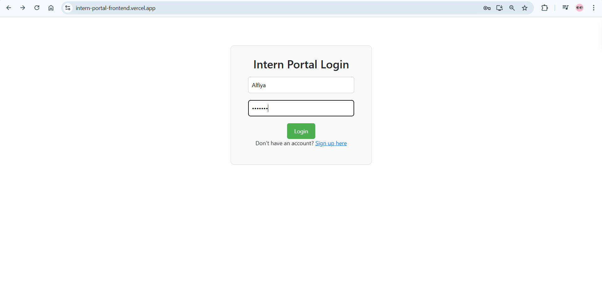
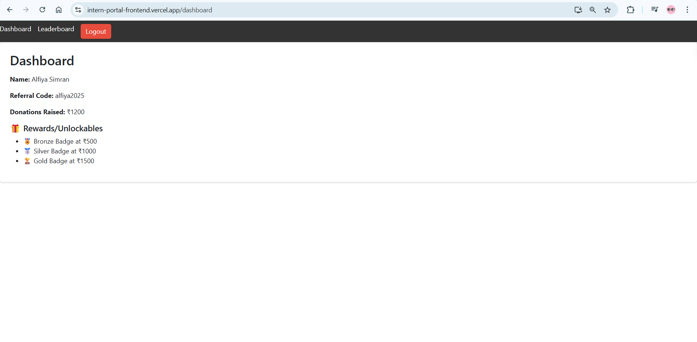
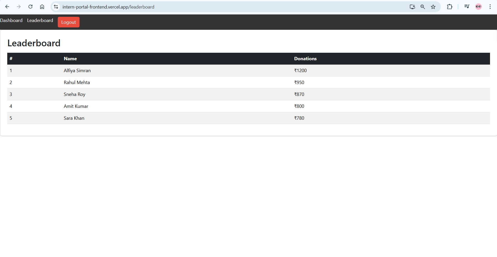

# 🧑‍💻 Intern Portal – Full Stack Project

A basic full-stack Intern Dashboard built using React and Express.  
This project was created as part of a full-stack assignment for showcasing intern profiles with dummy login/signup functionality.

---

## 📂 Project Structure

> The application is split into two separate repositories:

🔸 **Frontend Repository**  
➡️ [`intern-portal-frontend`](https://github.com/Alfiya-Simran/intern-portal-frontend)

🔸 **Backend Repository**  
➡️ [`intern-portal-backend`](https://github.com/Alfiya-Simran/intern-portal-backend)

---
## 🚀 Features

- Dummy Login & Signup Pages (no auth logic)
- Intern Dashboard view showing:
  - Name
  - Domain
  - College
  - Status (Selected / On Hold / Rejected)
- Basic navigation and UI elements

---

## ⚙️ Tech Stack

| Layer       | Tech Used            |
|-------------|----------------------|
| Frontend    | React, Tailwind CSS  |
| Backend     | Express.js, Node.js  |
| Styling     | CSS Modules / Tailwind |
| API Comm    | Axios                |

---

## 🛠 Setup Instructions

### 🔹 Frontend

```bash
git clone https://github.com/Alfiya-Simran/intern-portal-frontend.git
cd intern-portal-frontend
npm install
npm start
```

> App runs at http://localhost:3000/

### 🔹 Backend

```bash
git clone https://github.com/Alfiya-Simran/intern-portal-backend.git
cd intern-portal-backend
npm install
node server.js
```

> Backend runs at http://localhost:5000/

### 📸 Snapshots

> ### 🔹 Login Page


> ### 🔹 Dashboard


> ### 🔹 Leaderboard


---

### Live Links

- Frontend: https://intern-portal-frontend.vercel.app/
- Backend: https://intern-portal-backend-wuk4.onrender.com/
